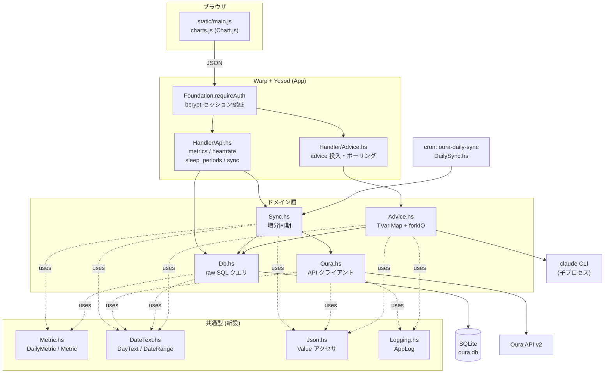
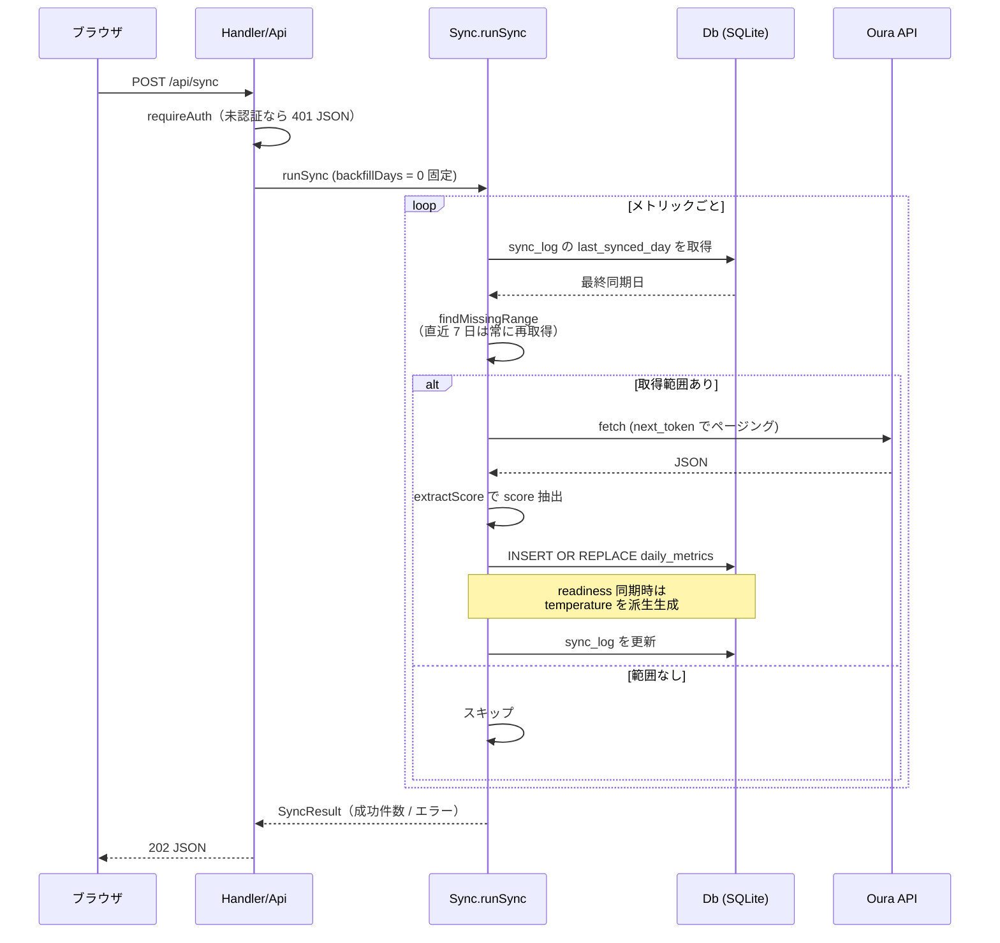
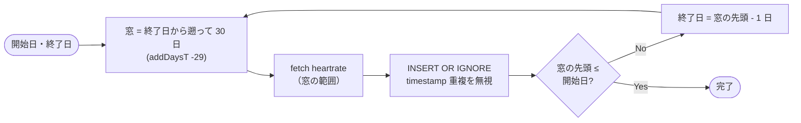

# oura-dashboard-hs コード全体の解説

## 1. これは何をするコードか

Oura Ring が計測した生体データ（睡眠・準備度・活動量・ストレス・SpO2・体温・心拍・レジリエンス・VO2 Max・心血管年齢）を、Oura API v2 からローカルの SQLite に取り込み、Chart.js 製の静的フロントエンドに JSON API で配信する、**ローカル完結型の Yesod (Haskell) Web アプリ**です。

Python/Flask 版 `oura-dashboard` からの移植で、**JSON API はバイト単位で互換**に保たれています。そのため `static/` 配下のフロントエンドは Python 版のものをそのまま流用しています。

加えて、`claude` CLI を子プロセスとして起動し、直近 14 日分のデータから日本語のヘルスアドバイスを生成する非同期ジョブ機能を持ちます。

直近のコミット（`42639a2`〜`2c61efc`, `refactor/haskell-idioms` ブランチ）で、メトリック名・日付・ログ出力先が生の `Text` からドメイン型（`Metric`/`DailyMetric`, `DayText`, `AppLog`）に置き換えられました。挙動は変えない前提の型化リファクタで、以下の解説はその後の状態を反映しています。

### たとえるなら

このアプリは **「自宅にある個人用の健康カルテ棚」** です。

- **Oura API** = 病院の検査機関。問い合わせれば結果をくれるが、毎回聞くのは遅いし失礼
- **SQLite (`oura.db`)** = 手元のカルテ棚。一度もらった検査結果はここに綴じておく
- **`Sync.hs`** = カルテ係。棚を見て「この日の分がまだ無い」と気づいたところだけ検査機関に取りに行く（＝増分同期）
- **Handler 層** = 受付窓口。閲覧者の身分証（セッション）を確認してから棚の中身を出す
- **`Advice.hs`** = 顧問医。カルテを読んで所見を書くが、時間がかかるので「後で取りに来てください」と整理券（ジョブ ID）を渡す
- **`Metric.hs` / `DateText.hs`** = カルテ棚のラベル規格。「メトリック名」「日付」はどこでも同じ書式・同じ語彙で扱う、という約束事をコンパイラに守らせる係

### 主要コンポーネント

| ファイル | 行数 | 役割 |
|---|---|---|
| `src/Oura.hs` | 133 | Oura API v2 クライアント。**fetch 関数を持つレコード型** (`OuraClient`) にすることで、テスト時にスタブへ差し替え可能。next_token ページネーション、15 秒タイムアウト、HTTP ステータスと例外を `OuraError` に正規化 |
| `src/Db.hs` | 205 | SQLite クエリ層。既存 Python スキーマとの 1:1 互換を保つため raw SQL 中心（`INSERT OR REPLACE` / `INSERT OR IGNORE`、`substr`、`GROUP BY`）。export リストなしで `module Db where` |
| `src/Sync.hs` | 309 | 増分同期の中核。`findMissingRange` / `backfillRanges` / `runSync`。心拍のみ 30 日窓で逆方向にループ |
| `src/Advice.hs` | 209 | アドバイスジョブ。TVar 上のインメモリ Map + `forkIO` ワーカーで `claude` CLI を実行（120 秒タイムアウト） |
| `src/Metric.hs` | 88 | **新規**。`DailyMetric` / `Metric` 型。旧版の「メトリック名を文字列で持ち回り `==` で分岐」をやめ、`dailyMetricName` に名前を一元化。`allDailyMetrics = [minBound..maxBound]` で総当たりを保証 |
| `src/DateText.hs` | 77 | **新規**。`DayText`（`YYYY-MM-DD` の newtype）と `DateRange`。`parseDayText` は形状チェックのみの `Maybe` 版、`parseDay` は `Day` への変換で失敗時 `error` |
| `src/Json.hs` | 42 | **新規**。`Value` に対する `jsonLookup`/`jsonText`/`jsonDouble`/`jsonInt`/`jsonArray`。Oura API のペイロードと `data_json` を読むための共通ヘルパー |
| `src/Logging.hs` | 83 | **新規**。`AppLog`（`LogLevel -> Text -> IO ()` を包んだ newtype）でプレーン `IO` から書けるログ出口を明示的に受け渡す。旧版のグローバルロガーを置き換え |
| `src/Foundation.hs` | 189 | `App` 型、bcrypt によるセッション認証（`requireAuth` → 401 JSON） |
| `src/Handler/Api.hs` | 150 | ログイン/ログアウト、metrics、heartrate、sleep_periods、sync |
| `src/Handler/Advice.hs` | 111 | advice の POST / ポーリング / 履歴 |
| `src/DailySync.hs` | 85 | cron 用 CLI。JST タイムスタンプ、7 日分 backfill、エラー時 exit 1 |
| `src/Application.hs` | 230 | `.env` ロード → 設定 → コネクションプール作成 → migrate → Warp 起動 |
| `static/*.js` | 838 | フロントエンド（main / charts / helpers / api） |

### データモデル（`config/models.persistentmodels`）

- `daily_metrics` — `(metric, day)` を主キーとし、`score` と生 JSON (`data_json`)、`synced_at` を保持
- `heartrate` — `(timestamp, bpm, day)`。`day` は集計用の非正規化カラム
- `sync_log` — メトリックごとの `last_synced_at`。増分同期の起点
- `advice_history` — 生成済みアドバイスの保存先
- `sleep_periods` — 睡眠期間ドキュメント。1 日に複数行（本睡＋仮眠）あるため、
  `(metric, day)` ではなく Oura の document id が主キー。`sleep_phase_5_min`
  を含む生 JSON を `data_json` に保持

### ルート（`config/routes.yesodroutes`）

```
/                          ダッシュボード（静的 HTML）
/api/login  /api/logout
/api/metrics  /api/metrics/#Text
/api/heartrate
/api/sleep_periods         睡眠段階チャート用（必要フィールドのみ返す）
/api/sync  /api/sync/status
/api/advice/history/#Text  （順序上 advice/#Text より先に定義）
/api/advice                POST でジョブ投入
/api/advice/#Text          "history" とジョブ ID を同一ハンドラで文字列分岐
```

---

## 2. 図解

### 図 A: システム全体構成



### 図 B: 増分同期のシーケンス



### 図 C: アドバイスジョブの状態遷移

```mermaid
stateDiagram-v2
    [*] --> queued: POST /api/advice<br/>ジョブ ID 発行・202 返却
    queued --> running: forkIO ワーカーが拾う
    running --> completed: claude CLI 正常終了
    running --> failed: 非ゼロ終了 / 120 秒タイムアウト / コマンド不在

    completed --> [*]: advice_history に保存<br/>GET で 200 返却
    failed --> [*]: GET で 502 返却

    note right of running
        ブラウザは GET /api/advice/{id} を
        ポーリング。未完了なら 202。
    end note

    note right of completed
        状態は TVar 上のインメモリ Map。
        プロセス再起動で消える
        （履歴は advice_history テーブルに残る）。
    end note
```



### 図 D: 心拍取得の 30 日窓ループ

心拍だけは他のメトリックと異なり、Oura API がサンプル単位（1 日数百件）で返すため、期間を 30 日ずつに区切って**新しい方から古い方へ**遡ります（`Sync.syncHeartrateRange`）。



---

## 3. 各モジュール・関数のつながりと役割

### 型の基盤（今回のリファクタで新設）

- **`Metric.hs`** — `DailyMetric`（`Sleep`〜`VO2Max` の 9 種）と `Metric`（`Daily DailyMetric | HeartrateSeries`）。`dailyMetricName` が DB・JSON API・Oura API で共有する唯一の文字列表現を作る。`allDailyMetrics = [minBound..maxBound]` により、新しいメトリックを追加すると `case` の非網羅で**コンパイルが落ちる**設計（`extractScore`, `fetchFn` など）。
- **`DateText.hs`** — `DayText`（`Text` の newtype、`Ord` はテキスト順＝この書式ではそのまま日付順）と `DateRange { rangeStart, rangeEnd }`。`parseDayText` は外部入力（URL セグメント・クエリパラメータ・リクエスト本文）向けの検証で、形状（`\d{4}-\d{2}-\d{2}`、テキスト順＝日付順を保つため）と暦としての妥当性（`1999-13-45` を弾く）の両方を見る。`parseDay` は `Day` への実変換で、失敗時は `error`。外部入力は必ず `parseDayText` を通るため、`parseDay` に届く日付は DB・`formatDay`・検証済み入力のいずれかに限られる。
- **`Json.hs`** — Oura API のペイロードと `data_json` を読む共通アクセサ。`Sync.hs`/`Advice.hs`/`Handler.Api`/`Handler.Advice` すべてが利用。
- **`Logging.hs`** — `AppLog`（`LogLevel -> Text -> IO ()` の newtype）。`Oura.OuraClient` の fetch 関数や `Advice.runAdviceJob` のような `forkIO`/プレーン `IO` の経路は `MonadLogger` を持てないため、ログ出口を値として明示的に受け渡す。`Application.makeFoundation` と `DailySync.dailySyncMain` の両方が自分の `LoggerSet` から `AppLog` を作る（プロセスごとに別ファイルへ書くため、共有はしない）。

### ドメイン層

- **`Oura.hs`** — `OuraClient` は 9 個の `DateRange -> IO [Value]` フィールドを持つレコード。`realClient` が http-conduit で実装し、`next_token` を追って全ページを結合する。非 2xx や通信失敗は `OuraError` として投げ、`Sync.tryOura` が捕捉する。テストではこのレコードをスタブに差し替える。
- **`Db.hs`** — Python 版 `db.py` の raw SQL を 1:1 移植。`mergeRow` が `data_json` に `day`/`score` を上書きマージする（DB の `score` 列が優先、Python の `{**data, "day":..., "score":...}` と同じ）。`getDailyMetricsBulk` は `M.fromListWith (flip (++))` で (metric, day) 順の行を集約。
- **`Sync.hs`** — `findMissingRange`（増分範囲の決定）、`backfillRanges`（欠損日の穴埋め範囲、日次メトリックは `score IS NOT NULL` で判定）、`syncDailyMetric`（フェッチ→`extractScore`→upsert、readiness 同期時は温度を派生生成）、`runSync`（メトリックごとに `foldRanges` で順にフェッチしつつ、`OuraError` はそのメトリックのエラーとして記録し次のメトリックへ進む）。心拍だけ `syncHeartrateRange` が 30 日窓で逆順ループ。
- **`Advice.hs`** — `buildHealthPayload`（直近 N 日分を `getDailyMetricsBulk` で取得し `extractKeyFields` でメトリックごとに必要フィールドだけ抜粋）→`buildAdvicePrompt`（日本語システムプロンプト＋JSON）→`createAdviceJob`（UUID 発行、`TVar (Map Text AdviceJob)` に `Queued` で登録）→`runAdviceJob`（`forkIO` 済みの別スレッドで `claude -p ... --model opus` を `readCreateProcessWithExitCode` 実行、120 秒 `timeout`、成功時は `advice_history` に保存）。

### Handler 層

- **`Foundation.hs`** — `App` レコード（DB プール、静的ファイル設定、`OuraClient` のテスト用差し替え口、advice ジョブ状態、`AppLog` など）。`requireAuth` がセッション未認証を 401 JSON で弾く。`checkPassword` は bcrypt 検証。
- **`Handler/Api.hs`** — `postLoginR`/`postLogoutR`（セッション設定）、`getMetricsR`/`getMetricR`（`parseRange` でクエリパラメータから `DateRange` を組み立て、`Db.getDailyMetrics(Bulk)` を呼ぶ）、`getHeartrateR`、`getSyncStatusR`、`postSyncR`（`appOuraClientOverride` があればそれを使い、なければ `OURA_TOKEN` から `realClient` を構築して `Sync.runSync` を実行、`backfillDays = 0` 固定）。日付を受け取る入口（`parseRange` のクエリパラメータ、sync 本文の `start`/`end`）はいずれも `requireDayText` を通し、不正な日付は 400 で弾く。`jsonBodyOrEmpty` は `parseCheckJsonBody` の結果を見て、パース失敗時だけ空オブジェクトにフォールバックする（後述：以前は `SomeException` を丸ごと捕捉していた）。
- **`Handler/Advice.hs`** — `postAdviceR`（14 日分のペイロードを作り、データが皆無なら 400、そうでなければジョブを作って `forkIO` で起動し 202 を返す）、`getAdviceJobR`（`seg == "history"` かジョブ ID かを文字列で分岐）、`adviceJobStatus`（ジョブの状態に応じて 200/502/202）、`getAdviceEntryR`（`parseDayText` で日付形式を検証してから履歴を引く）。
- **`Handler/Home.hs`** / **`Handler/Common.hs`** — 静的な `index.html`・favicon・robots.txt の配信。

### エントリポイント

- **`Application.hs`** — `.env` ロード→`AppSettings` 読み込み→`SECRET_KEY` 必須チェック→ロガー2系統（アプリ用 `appLogger`/`appPlainLogger`、アクセスログ用 `appAccessLoggerSet`）の初期化→DB プール作成→`migrateAll`→Warp 起動。`app/main.hs`（本番）と `app/devel.hs`/`DevelMain.hs`（開発）から呼ばれる。
- **`DailySync.hs`** — cron から `app-daily-sync/main.hs` 経由で実行される CLI。JST の「今日」（`todayIn (hoursToTimeZone 9)`）を基準に 7 日分の backfill 付きで `runSync` を呼び、いずれかのメトリックがエラーなら `exitWith (ExitFailure 1)`。

### フロントエンド

`static/main.js`（画面制御）・`charts.js`（Chart.js 描画）・`helpers.js`（共通関数）・`api.js`（`apiFetch` ラッパー、401 時にログインモーダルを出す）。Python 版と JSON 契約が同じなので変更なしで流用されている。

---

## 4. 潜在的な改善点

実害が大きいと思われる順に挙げます。**静的読解による判断で、再現テストは未実施です。** 前回のレビュー以降に解消された項目は末尾にまとめています。

### 中: 「今日」の基準がモジュール間で不一致

`Handler.Api` の `parseRange`/`postSyncR` は `DateText.todayUtc` を、`DailySync.todayJst` は JST（`todayIn (hoursToTimeZone 9)`）を使う。JST 深夜帯（0:00〜9:00）では両者が指す日付が 1 日ずれるため、Web からの同期と cron からの同期で対象範囲が食い違う。どちらかに統一すべき。

### 中: アドバイスジョブが無制限に蓄積する

`Advice.AdviceJobs`（`TVar (Map Text AdviceJob)`）から完了・失敗ジョブを回収する仕組みがない。長時間稼働でメモリが単調増加する。Python 版も同じ構造だが、移植先で TTL 付き削除を入れられる。

### 低: `getDailyMetricsBulk` の集約が O(n²) になりうる

`Db.getDailyMetricsBulk` は `M.fromListWith (flip (++))` で行を集約するが、`flip (++) new old = old ++ new` は毎回 `old` 全体をたどるため、1 メトリックあたりの行数の二乗に比例する。14〜30 日分なら無害だが、長期間を指定するアドバイス機能（`buildHealthPayload`）などで期間を拡張すると劣化する。逆順に積んで最後に `reverse` するか `Data.Sequence` を使えば線形になる。

### 低: advice ルートが URL の文字列比較で分岐している

`/api/advice/#Text`（`AdviceJobR`）が `"history"` かジョブ ID かを `Handler.Advice.getAdviceJobR` 内の文字列比較で判定している。ジョブ ID は UUID なので実害はないが、ルート定義を分けたほうが堅牢。

### 低: Web 経由の sync だけ backfill が働かない

`Handler.Api.postSyncR` は `Sync.runSync ... 0`（`backfillDays = 0` 固定）で、欠損日のバックフィルは `DailySync`（cron、`backfillDays = 7`）のみが担う。意図的な設計と思われるが、非対称なので挙動を把握していないと「Web から同期したのに古い欠損が埋まらない」と混乱する。

### 低: `src/Db.hs` に export リストがない

`module Db where` なので内部ヘルパーも全公開。他モジュールとの契約が不明瞭。

### 低: ログ言語が層によって混在

`Sync.hs`/`Oura.hs`/`Advice.hs` の `$logInfo`/`writeLog` によるログ行自体は英語だが、`Advice.runAdviceJob` の失敗メッセージ（`fail'` に渡す文字列）はユーザー向け日本語文言をそのままログにも書いている。ユーザー向け応答と内部ログを同じ文字列で兼用しているため、ログを追う際に言語が混在する。

### 確認済み・問題なし

- `oura.db` / `*.sqlite3` / `config/client_session_key.aes` / `.env` はいずれも `.gitignore` 済みで、リポジトリには含まれていない。
- `runAdviceJob` は `proc` で `claude` CLI を起動しており（シェル経由ではない）、コマンドインジェクションの余地はない。プロンプト内容も DB 由来。

### 前回レビュー以降に解消された項目

- **「日付パースが `error` を呼び 500 クラッシュしうる」（旧・高）** — まず `DateText.parseDayText` と `Handler.Advice.getAdviceEntryR` の 400 化で advice 履歴経路が解消。残っていた `POST /api/sync` の心拍経路も、`parseDayText` に暦としての妥当性検証を追加し（形状チェックだけでは `1999-13-45` を通してしまうため）、`Handler.Api.requireDayText` が `parseRange` のクエリパラメータと sync 本文の `start`/`end` の両方を検証して失敗時に 400 を返すようになったことで解消。これにより外部から入った `DayText` は必ず `parseDay` でパースできる。
- **「`parseBodyOr` が `SomeException` を握り潰す」（旧・中）** — コミット `1d698e2`/`8b206e7` で `Handler.Api.jsonBodyOrEmpty` が `parseCheckJsonBody` の結果を見てパース失敗時のみフォールバックする実装に変更され、非同期例外を含む無関係な例外まで飲み込む問題は解消。
- **メトリック名・日付・グローバルロガーが文字列/暗黙状態だった問題** — コミット `1835052` で `Metric.hs`（`DailyMetric`/`Metric`）、`DateText.hs`（`DayText`/`DateRange`）、`Logging.hs`（`AppLog`）に型化され、ディスパッチの網羅性がコンパイル時に保証されるようになった。
