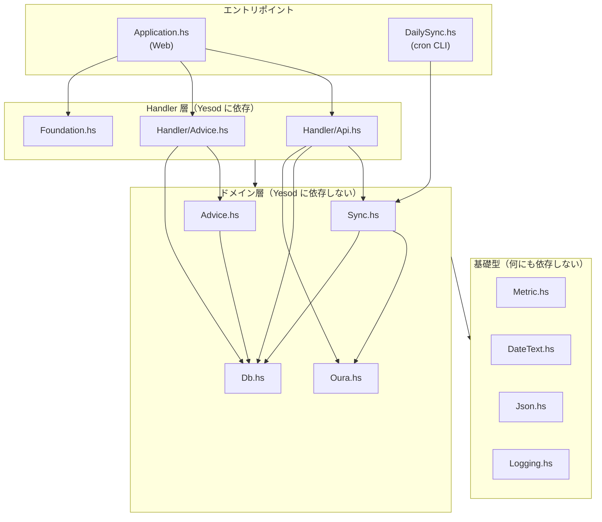

# 第 1 章 プロジェクトの歩き方と設計の骨格

## 1.1 このアプリは何をするか

Oura Ring（睡眠計測リング）が測ったデータを、

1. Oura API v2 から取得し（`Oura.hs`）
2. 欠けている日付だけを判定して同期し（`Sync.hs`）
3. ローカルの SQLite に貯め（`Db.hs`）
4. ブラウザに JSON API として返す（`Handler/*.hs`）

という、**取り込み・保存・配信**の 3 つに分かれた小さなアプリです。加えて `claude` CLI を子プロセスとして起動し、非同期ジョブで健康アドバイスを生成する機能があります（`Advice.hs`）。

規模は `src/` が約 2,200 行、テストとエントリポイントを合わせて約 3,200 行。「読み切れる大きさで、実務にある要素（HTTP クライアント、DB、認証、非同期ジョブ、CLI、テスト）が一通り入っている」ため、教材にちょうど良い題材です。

## 1.2 まず型と依存の向きを見る

新しい Haskell プロジェクトを読むときの手順は、**ファイルの中身を上から読むことではありません**。次の順で見ます。

1. `package.yaml` — 何のライブラリに依存しているか
2. モジュールの export リスト — 各モジュールが外に何を約束しているか
3. 主要な型の定義 — データがどう表現されているか
4. 依存の向き — 誰が誰を import しているか

### 依存の向き



重要なのは **矢印が下向きにしかない**ことです。`Metric.hs` は `Sync.hs` を知らないし、`Sync.hs` は `Handler` を知らない。これが守られていると、

- 下の層を単体でテストできる（第 11 章）
- Web アプリと cron CLI という 2 つのエントリポイントが、同じドメイン層を共有できる
- 上の層（Yesod）を差し替えても下は無傷

という利点が出ます。`Sync.hs` が Yesod に依存していないからこそ、`DailySync.hs`（Warp も Foundation も持たない、ただの CLI）が同じ `runSync` を呼べます。

```haskell
-- src/DailySync.hs:78
result <- flip runSqlPool pool $
    runSync today client Nothing Nothing Nothing backfillDays
```

```haskell
-- src/Handler/Api.hs:120
result <- runDB $ Sync.runSync today client requestedStart (Just requestedEnd) requestedMetrics 0
```

同じ関数を、片方は `LoggingT IO`、片方は Yesod の `Handler` の上で呼んでいます。これが可能な理由は第 5 章（型クラス制約）で扱います。

## 1.3 export リストは「契約」

Haskell のモジュールは、`module M (a, b, c) where` と書くと `a, b, c` だけを公開します。省略すると全部公開されます。

このリポジトリには両方の例があります。

```haskell
-- src/Metric.hs:12 — 公開するものを列挙している
module Metric
    ( DailyMetric (..)
    , Metric (..)
    , dailyMetricName
    , parseDailyMetric
    , metricName
    , allDailyMetrics
    , dashboardMetrics
    , syncTargets
    , syncStatusMetrics
    ) where
```

```haskell
-- src/Db.hs:12 — 全部公開してしまっている
module Db where
```

`Db.hs` の書き方だと、内部ヘルパー（`parseDataJson`、`mergeRow`、`nowIso`）まで外から使えてしまいます。「どれが外向けの API で、どれが実装の都合か」がコードから読み取れません。将来 `mergeRow` の引数を変えたいとき、影響範囲がモジュール内に閉じている保証がありません。

**実務での指針**: 型は `(..)` で公開するか、コンストラクタを隠して賢い構築関数（smart constructor）だけ公開するかを意識的に選ぶ。関数は「外から呼ぶもの」だけ書く。export リストを書くのは面倒ですが、それ自体がモジュール設計のレビューになります。

なお `DayText` は `DayText (..)` でコンストラクタを公開しています（`src/DateText.hs:11`）。これは意図的に緩めた設計で、その代償が第 4 章と第 13 章の演習 1 に出てきます。

## 1.4 Prelude を置き換えている

全モジュールの先頭に、次の 2 つが並んでいます。

```haskell
{-# LANGUAGE NoImplicitPrelude #-}
{-# LANGUAGE OverloadedStrings #-}
```

`NoImplicitPrelude` は標準 Prelude の自動 import を止める拡張です。その代わりに `ClassyPrelude`（あるいは `ClassyPrelude.Yesod`）を import しています。

```haskell
-- src/Metric.hs:24
import ClassyPrelude
```

なぜそうするのか、何が変わるのかは第 12 章で詳しく扱いますが、いま知っておくべきことは 2 つだけです。

1. `String` ではなく `Text` が既定。`length`、`take`、`null` などは `Text`・`Map`・`Set` にも効く多相版になっている。
2. `head`、`tail` のような部分関数（例外を投げる関数）は標準 Prelude 版が隠され、`headMay :: mono -> Maybe (Element mono)` のような安全版が提供される。

`OverloadedStrings` は文字列リテラル `"sleep"` を `Text` としても `ByteString` としても使えるようにする拡張です。`Text` 主体のコードではほぼ必須です。

## 1.5 コード生成（Template Haskell）が使われている箇所

このプロジェクトは 3 か所でコード生成を使っています。初見で戸惑うポイントなので、先に地図を出しておきます。

| 場所 | 生成されるもの | 入力ファイル |
|---|---|---|
| `src/Model.hs:24` | DB エンティティ型 + マイグレーション | `config/models.persistentmodels` |
| `src/Foundation.hs:68` | ルート型 `Route App` とパス解析 | `config/routes.yesodroutes` |
| `src/Application.hs:56` | ルート → ハンドラのディスパッチ | 上のルート定義 |

```haskell
-- src/Model.hs:24
share [mkPersist sqlSettings, mkMigrate "migrateAll"]
    $(persistFileWith lowerCaseSettings "config/models.persistentmodels")
```

`$( ... )` が Template Haskell のスプライスです。コンパイル時に外部ファイルを読み、Haskell のソースを生成して埋め込みます。生成された型（`DailyMetric`、`Heartrate`、`SyncLog`、`AdviceHistory` などのエンティティ）は grep しても定義が見つかりません。詳細は第 9 章で扱います。

**先に知っておくべき罠**: `$logInfo` のような Template Haskell スプライスを使うモジュールには `{-# LANGUAGE TemplateHaskell #-}` が必要です。無いと `$` が「関数適用演算子」として解釈され、原因の分かりにくいパースエラーになります（`.claude/CLAUDE.md` にも記載）。

## 1.6 この章のまとめ

- 読む順序は「依存関係 → 型 → 実装」。上から読まない。
- 層をまたぐ矢印は一方向に保つ。ドメイン層が Web フレームワークを知らないことが、テスト容易性と再利用（Web + cron）を生む。
- export リストはモジュールの契約。省略は「設計を書かない」という選択。
- `NoImplicitPrelude` + `ClassyPrelude` + `OverloadedStrings` がこのプロジェクトの標準構え。

## 演習

1. `src/Sync.hs` の import 群を見て、この関数が依存している「外の世界」を列挙してください（DB、HTTP、時刻、ログ）。それぞれがどうやって関数に渡されているかを確認してください。
2. `src/Handler/Api.hs` が `Oura.realClient` を直接呼んでいる箇所（`postSyncR`）を探し、なぜドメイン層でなく Handler 層でクライアントを組み立てているのか考えてください。答えは第 6 章にあります。
