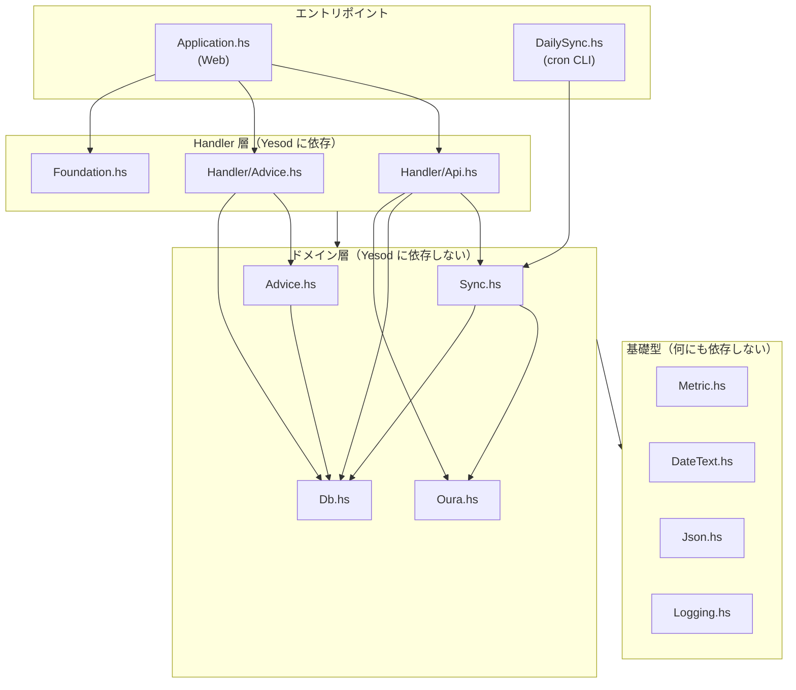

# 第 1 章 Haskell のソースを読む

> **この章で復習する文法**: コメントと Haddock 記法、`module` 宣言と export リスト、`import` の 4 つの形、`{-# LANGUAGE #-}` プラグマ、型シグネチャの読み方（`::`、`->`、`=>`）、レイアウト規則、識別子の命名規則

Haskell のソースを開くと、まず `{-# LANGUAGE ... #-}` が並び、次に `module ... where`、その後に大量の `import` が来ます。ここを「おまじない」として飛ばすと、いつまでも読めるようになりません。**ファイルの先頭 30 行には、そのモジュールが何をするかの要約が入っています。**

この章では、ファイルの読み方と、このプロジェクトの地図を同時に手に入れます。

## 1.1 このアプリは何をするか

Oura Ring（睡眠計測リング）が測ったデータを、

1. Oura API v2 から取得し（`Oura.hs`）
2. 欠けている日付だけを判定して同期し（`Sync.hs`）
3. ローカルの SQLite に貯め（`Db.hs`）
4. ブラウザに JSON API として返す（`Handler/*.hs`）

という、**取り込み・保存・配信**の 3 つに分かれた小さなアプリです。加えて `claude` CLI を子プロセスとして起動し、非同期ジョブで健康アドバイスを生成する機能があります（`Advice.hs`）。

規模は `src/` が約 2,200 行、テストとエントリポイントを含めて約 3,200 行。「一人で読み切れる大きさで、実務にある要素（HTTP クライアント、DB、認証、非同期ジョブ、CLI、テスト）が一通り入っている」ため、教材にちょうど良い題材です。

## 1.2 読む順序は「依存 → 型 → 実装」

新しい Haskell プロジェクトを読むとき、ファイルを上から読むのは最悪の手です。次の順で見ます。

1. `package.yaml` — 何のライブラリに依存しているか
2. 各モジュールの export リスト — 外に何を約束しているか
3. 主要な型定義 — データがどう表現されているか
4. 依存の向き — 誰が誰を import しているか

### 依存の向き



重要なのは **矢印が下向きにしかない**ことです。`Metric.hs` は `Sync.hs` を知らず、`Sync.hs` は `Handler` を知りません。これが守られていると、

- 下の層を単体でテストできる（第 14 章）
- Web アプリと cron CLI という 2 つのエントリポイントが、同じドメイン層を共有できる
- 上の層（Yesod）を差し替えても下は無傷

という利点が出ます。実際、同じ `runSync` が 2 か所から呼ばれています。

```haskell
-- src/DailySync.hs:78 — cron CLI から
result <- flip runSqlPool pool $
    runSync today client Nothing Nothing Nothing backfillDays
```

```haskell
-- src/Handler/Api.hs:120 — Yesod ハンドラから
result <- runDB $ Sync.runSync today client requestedStart (Just requestedEnd) requestedMetrics 0
```

前者は `LoggingT IO` の上、後者は Yesod の `Handler` の上で動いています。これが可能な理由（型クラス制約による多相）は第 8 章で扱います。

## 1.3 ファイル先頭の 4 ブロック

`src/Metric.hs` の先頭を、ブロックごとに読み解きます。

```haskell
{-# LANGUAGE NoImplicitPrelude #-}         -- ① 言語拡張
{-# LANGUAGE OverloadedStrings #-}
{-# LANGUAGE LambdaCase        #-}

-- | The metrics the dashboard tracks.                    -- ② モジュールの Haddock
--
-- The Python port carried these as bare strings and dispatched on them with
-- @==@ throughout the sync, DB and handler layers. As a type, the compiler
-- checks that every dispatch table is total, the wire names live in one place,
-- and the "heartrate is not a daily metric" distinction the code kept making
-- by hand is in the type instead.
module Metric                                             -- ③ モジュール名と export リスト
    ( DailyMetric (..)
    , Metric (..)
    , dailyMetricName
    , parseDailyMetric
    , metricName
    , allDailyMetrics
    , dashboardMetrics
    , syncTargets
    , syncStatusMetrics
    ) where

import ClassyPrelude                                      -- ④ import 群
```

### 文法メモ: コメントと Haddock

| 記法 | 意味 |
|---|---|
| `-- ...` | 行コメント |
| `{- ... -}` | ブロックコメント（入れ子可） |
| `-- \| ...` | 直後の宣言に付くドキュメント |
| `-- ^ ...` | 直前の宣言・フィールド・引数に付くドキュメント |
| `@code@` | Haddock 内のインラインコード |
| `'name'` | Haddock 内の識別子リンク |

`-- ^` は引数のドキュメントに便利です。このプロジェクトはシグネチャの途中で多用しています。

```haskell
-- src/Sync.hs:215
runSync
    :: (MonadUnliftIO m, MonadLogger m)
    => DayText                -- ^ today
    -> OuraClient
    -> Maybe DayText          -- ^ requested_start
    -> Maybe DayText          -- ^ requested_end
    -> Maybe [Metric]         -- ^ metrics (Nothing = every sync target)
    -> Int                    -- ^ backfill_days
    -> ReaderT SqlBackend m SyncResult
```

**同じ型の引数が並ぶときは、`-- ^` で名前を付けるのが実務の作法です。** `Maybe DayText` が 2 つ並んでいるので、これがないと呼び出し側で順序を間違えます。

### 文法メモ: `module` 宣言と export リスト

```haskell
module Metric ( DailyMetric (..), dailyMetricName ) where
```

- 括弧内に列挙したものだけが外から見えます。**省略すると全部公開**です。
- 型は `DailyMetric` と書くと型名だけ、`DailyMetric (..)` と書くとコンストラクタも公開されます。
- `module Foo (module Bar) where` と書くと、import したものをそのまま再輸出できます（`src/Import.hs` がこの形）。

```haskell
-- src/Import.hs（全 6 行）— re-export だけを行うモジュール
module Import
    ( module Import
    ) where

import Foundation            as Import
import Import.NoFoundation   as Import
```

`import Foundation as Import` は「`Foundation` の中身を `Import` という別名で取り込む」宣言で、その `Import` を丸ごと re-export しています。ハンドラは `import Import` の 1 行で必要なものが全部揃う、という仕掛けです。

このリポジトリには対照的な 2 つの例があります。

```haskell
-- src/Metric.hs:12 — 公開するものを列挙している
module Metric ( DailyMetric (..), Metric (..), dailyMetricName, ... ) where

-- src/Db.hs:12 — 全部公開してしまっている
module Db where
```

`Db.hs` の書き方だと、内部ヘルパー（`parseDataJson`、`mergeRow`、`nowIso`）まで外から使えます。「どれが外向けの API で、どれが実装の都合か」がコードから読み取れません。**export リストはモジュールの契約であり、書くこと自体が設計のレビューになります**（第 16 章で改善案を示します）。

### 文法メモ: `import` の 4 つの形

```haskell
import ClassyPrelude                           -- (1) 全部そのまま取り込む
import ClassyPrelude hiding (foldM)            -- (2) 一部を除いて取り込む
import Data.Aeson (Value)                      -- (3) 挙げたものだけ取り込む
import qualified Data.Map.Strict as M          -- (4) 修飾名でのみ使う
```

`Sync.hs` の import 群は、この 4 形式が全部出てくる良い教材です。

```haskell
-- src/Sync.hs:26
import ClassyPrelude hiding (foldM)
import qualified Data.Aeson       as A
import Data.Aeson                 (Value)
import qualified Data.Aeson.KeyMap   as KM
import qualified Data.Map.Strict  as M
import Control.Monad              (foldM)
...
import Oura hiding (getHeartrate)
import qualified Oura
```

読みどころが 2 つあります。

**(1) `hiding` + 明示 import の組み合わせ。** ClassyPrelude の `foldM` を隠し、`Control.Monad` の `foldM` を使っています。同名で型が違う関数があるためです（第 9 章）。

**(2) 同じモジュールを 2 通りで import。** `import Oura hiding (getHeartrate)` と `import qualified Oura` を並べることで、`getHeartrate` だけは `Oura.getHeartrate` と修飾して呼びます。`Db.hs` にも `getHeartrate` があり、両方を使うモジュールでは名前が衝突するからです。

```haskell
-- src/Sync.hs:279 — 修飾して呼んでいる
recs <- liftIO $ Oura.getHeartrate client (DateRange windowStart windowEnd)
```

**判断の指針**: 大量の名前を提供するモジュール（Prelude 代替、フレームワーク）は無修飾、コンテナ系（`Data.Map`、`Data.Text`）は `qualified`、型だけ欲しいときは明示 import。このプロジェクトはこの慣習どおりです。

### 文法メモ: `{-# LANGUAGE #-}` プラグマ

GHC の言語拡張を、そのファイルに限って有効にします。全モジュールに共通するのはこの 2 つです。

```haskell
{-# LANGUAGE NoImplicitPrelude #-}
{-# LANGUAGE OverloadedStrings #-}
```

- `NoImplicitPrelude` — 標準 Prelude の自動 import を止めます。代わりに `ClassyPrelude`（あるいは `ClassyPrelude.Yesod`）を import しています。
- `OverloadedStrings` — 文字列リテラル `"sleep"` を `Text` や `ByteString` としても使えるようにします。`Text` 主体のコードではほぼ必須です。

**拡張の一覧はモジュールの要約です。** 例えば `{-# LANGUAGE ScopedTypeVariables #-}` があれば「例外を型で絞って捕まえている」（第 7 章）、`{-# LANGUAGE TemplateHaskell #-}` があれば「コード生成かログのスプライスがある」と当たりが付きます。拡張の全体像は第 15 章で整理します。

## 1.4 型シグネチャを読む

Haskell を読む力の 8 割は、シグネチャを読む力です。

```haskell
-- src/Metric.hs:50
dailyMetricName :: DailyMetric -> Text
```

`::` は「〜という型を持つ」。`->` は関数の型です。**`->` は右結合**なので、引数が複数ある関数は次のように読めます。

```haskell
-- src/Db.hs:47
upsertDailyMetric
    :: (MonadIO m)
    => DailyMetric -> DayText -> Maybe Double -> A.Value -> ReaderT SqlBackend m ()
```

これは

```haskell
DailyMetric -> (DayText -> (Maybe Double -> (A.Value -> ReaderT SqlBackend m ())))
```

と同じ意味です。つまり **「引数を 1 つ取って、残りを取る関数を返す関数」** が連なっています（カリー化）。だから引数を一部だけ与える「部分適用」が自然に書けます（第 2 章）。

`=>` の左は**制約**です。

```haskell
findMissingRange
    :: (MonadIO m)                                  -- 制約: m は IO を実行できる
    => DayText -> Metric -> DayText                 -- 引数 3 つ
    -> ReaderT SqlBackend m (Maybe DateRange)       -- 戻り値
```

小文字で始まる `m` は**型変数**（呼び出し側が決める）、大文字で始まる `DayText` や `Metric` は**具体的な型**です。制約は「この型変数はこういう能力を持っていなければならない」という要求で、実務のコードでは**その関数が何をしうるかの宣言**として読みます（第 8 章）。

### GHCi で確かめる

型は読むだけでなく、確かめるものです。

```sh
printf ':t groupBy\n' | stack exec ghci -- -v0
```

```
groupBy :: IsSequence seq => (Element seq -> Element seq -> Bool) -> seq -> [seq]
```

`:i`（info）を使うとインスタンスまで表示されます。

```sh
printf ':i Single\n' | stack exec ghci -- -v0
```

```
newtype Single a = Single {unSingle :: a}
instance PersistField a => RawSql (Single a)
...
```

**名前から挙動を推測しない**、というのがこのプロジェクトの Haskell 規約（`~/.claude/rules/haskell.md`）の第一項です。`groupBy` が隣接要素しか見ないこと、`nub` が O(n²) であることは、名前からは分かりません。

## 1.5 レイアウト規則（オフサイドルール）

Haskell はインデントで構造を表します。規則は 1 つだけ覚えれば足ります。

> `where` / `let` / `do` / `of` の直後に現れた**最初のトークンの桁位置**が、そのブロックの基準になる。同じ桁で始まる行は「次の項目」、深い桁は「継続行」、浅い桁は「ブロックの終わり」。

```haskell
-- src/Sync.hs:89
findMissingRange today metric requestedEnd = do
    mlast <- getLastSyncedDay metric        -- 基準は 5 桁目
    let end = min requestedEnd today        -- 同じ桁 → 次の項目
    case mlast of
        Nothing -> return $ Just (DateRange defaultStart end)
        Just lastDay ->
            let refetchStart = addDaysT (negate (refetchDays - 1)) today
                nextDay      = addDaysT 1 lastDay      -- let の 2 つ目の束縛
                fetchStart   = min refetchStart nextDay
            in return $ if fetchStart > end
                        then Nothing
                        else Just (DateRange fetchStart end)
```

`let ... in ...` は式、`do` の中の `let`（`in` なし）は文です。上の例には両方が出てきます。

- `let end = ...`（`do` の中、`in` なし）— 以降の文で `end` が使える
- `let refetchStart = ... in return $ ...`（式）— `in` の後ろでだけ使える

### 文法メモ: 演算子と識別子の命名規則

| 形 | 何になるか | 例 |
|---|---|---|
| 小文字で始まる | 変数・関数・型変数 | `dailyMetricName`, `m` |
| 大文字で始まる | 型・データコンストラクタ・モジュール名 | `DayText`, `Sleep`, `Metric` |
| 記号だけ | 演算子（中置） | `<>`, `=<<`, `.=` |
| `` `f` `` | 関数を中置で使う | ``d `member` existing`` |
| `(+)` | 演算子を前置で使う | `foldr (+) 0` |

```haskell
-- src/Sync.hs:172 — 中置化で「d は existing に含まれるか」と読める
isMissing d = not (d `member` existing) || d == today

-- src/Metric.hs:83 — セクション記法（演算子の片側だけ与える）
map Daily (filter (`notElem` [Temperature, VO2Max]) allDailyMetrics)
```

`` (`notElem` [Temperature, VO2Max]) `` は「引数が `[Temperature, VO2Max]` に含まれないか」を判定する関数です。**演算子の片方だけを与えて関数を作る**この書き方（セクション）は頻出します。

## 1.6 コード生成が使われている箇所

このプロジェクトは 3 か所で Template Haskell（コンパイル時のコード生成）を使っています。初見で戸惑うポイントなので、地図を先に出します。

| 場所 | 生成されるもの | 入力ファイル |
|---|---|---|
| `src/Model.hs:24` | DB エンティティ型 + マイグレーション | `config/models.persistentmodels` |
| `src/Foundation.hs:68` | ルート型 `Route App` とパス解析 | `config/routes.yesodroutes` |
| `src/Application.hs:56` | ルート → ハンドラのディスパッチ | 上のルート定義 |

```haskell
-- src/Model.hs:24
share [mkPersist sqlSettings, mkMigrate "migrateAll"]
    $(persistFileWith lowerCaseSettings "config/models.persistentmodels")
```

`$( ... )` が Template Haskell のスプライスです。コンパイル時に外部ファイルを読み、Haskell のソースを生成して埋め込みます。したがって、**生成された型（`Heartrate`、`SyncLog` など）は grep しても定義が見つかりません**。詳細は第 12 章で扱います。

**先に知っておくべき罠**: `$logInfo` のような TH スプライスを使うモジュールには `{-# LANGUAGE TemplateHaskell #-}` が必要です。無いと `$`（関数適用演算子）として解釈され、原因の分かりにくいパースエラーになります。

## 1.7 この章のまとめ

- 読む順序は「依存関係 → 型 → 実装」。ファイルを上から読まない。
- 層をまたぐ矢印は一方向に保つ。ドメイン層が Web フレームワークを知らないことが、テスト容易性と再利用（Web + cron）を生む。
- export リストはモジュールの契約。省略は「設計を書かない」という選択。
- import は 4 形式を使い分ける。同名衝突は `hiding` と `qualified` で解く。
- 拡張の一覧はモジュールの要約として読める。
- `->` は右結合。`=>` の左は制約。型変数は小文字、具体型は大文字。
- 型は読むだけでなく `:t` / `:i` で確かめる。名前から挙動を推測しない。

### 文法チェックリスト

| 構文 | 意味 | 本章での実例 |
|---|---|---|
| `-- \|` / `-- ^` | Haddock（後続／直前に付く） | `runSync` の引数注釈 |
| `module M (a, T (..)) where` | export リスト。`(..)` はコンストラクタも公開 | `Metric.hs` |
| `module M (module X) where` | re-export | `Import.hs` |
| `import M hiding (f)` | 一部を除いて取り込む | `import ClassyPrelude hiding (foldM)` |
| `import qualified M as N` | 修飾名でのみ使う | `import qualified Data.Map.Strict as M` |
| `{-# LANGUAGE X #-}` | 言語拡張の有効化 | 全ファイル冒頭 |
| `f :: A -> B -> C` | 右結合。カリー化された 2 引数関数 | `upsertDailyMetric` |
| `(C a) => ...` | 型クラス制約 | `MonadIO m =>` |
| `let ... in ...` / `do` 内 `let` | 式としての束縛／文としての束縛 | `findMissingRange` |
| `` `f` `` / `(+)` | 中置化／前置化 | `` d `member` existing `` |
| `(`f` x)` | セクション（片側適用） | `` (`notElem` [...]) `` |
| `$( ... )` | Template Haskell スプライス | `Model.hs` |
